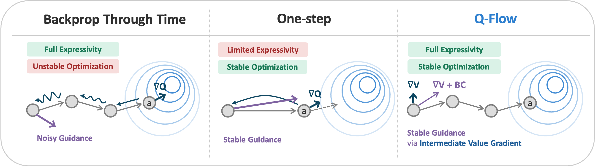

&nbsp;
<div id="user-content-toc" style="margin-bottom: 40px;margin-top: 60px">
  <ul align="center" style="list-style: none;">
    <summary>
      <h1> Q-Flow: Stable and Expressive Reinforcement Learning with Flow-Based Policy </h1>
      <h3>
        <a href="https://www.linkedin.com/in/jaehyeok-doo-5768a5231/">JaeHyeok Doo</a><sup>1,*</sup>,
        <a href="https://www.linkedin.com/in/byeongguk-jeon-4b62b627a">Byeongguk Jeon</a><sup>1</sup>,
        <a href="https://seonghyeonye.github.io/">Seonghyeon Ye</a><sup>1</sup>,
        <a href="https://sites.google.com/view/kiminlee">Kimin Lee</a><sup>1</sup>,
        <a href="https://seominjoon.github.io/">Minjoon Seo</a><sup>1</sup>
      </h3>
      <p><sup>1</sup> KAIST &emsp; <sup>*</sup> Corresponding author &nbsp;·&nbsp; <a href="mailto:jdoo2@kaist.ac.kr">jdoo2@kaist.ac.kr</a></p>
      <br>
      <h2>[<a href="https://arxiv.org/abs/2605.13435">Paper</a>]
       &emsp;|&emsp; [<a href="https://jaehyeokdoo2.github.io/qflow">Website</a>]</h2>
    </summary>
  </ul>
</div>


<p align="center">
  
</p>

## Overview
Q-Flow is a flow-based RL algorithm that learns the value of intermediate noise and guide action sampling process toward high-value region. For the method, experiments, and results, please refer to the [paper](https://arxiv.org/abs/2605.13435) and the [project website](https://jaehyeokdoo2.github.io/qflow).

This codebase is built on the [FQL framework](https://github.com/seohongpark/fql) and requires Python 3.9+ and JAX. The main dependencies are `jax >= 0.4.26`, `ogbench == 1.1.0`, and `gymnasium == 0.29.1`.

Installation: `pip install -r requirements.txt`

> **Note:** To use D4RL environments, you need to additionally set up MuJoCo 2.1.0.

## 2D toy experiment

The `2d_experiment/` directory contains a self-contained notebook that reproduces the 2D toy experiments comparing QFlow against FQL and FBRAC on synthetic datasets (`moons`, `two_spirals`, `swissroll`, `eight_gaussians`).

```bash
jupyter notebook 2d_experiment/toy_experiment_notebook.ipynb
```

Edit the `CONFIGURATION` cell to choose the methods, tasks, and hyperparameters, then run all cells. The supporting modules live alongside the notebook (`networks.py`, `datasets.py`, `agents.py`).

## Main Experiments (standard setting)

QFlow hyperparameters are passed as `--agent.<key>=<value>` flags; anything not passed falls back to the defaults in [agents/qflow.py](agents/qflow.py). Refer to the paper for the per-domain hyperparameters used in the main experiments.

```bash
# QFlow with default hyperparameters
python main.py --env_name=antmaze-large-navigate-singletask-task1-v0 --agent=agents/qflow.py

# QFlow with explicit hyperparameters
python main.py --env_name=antmaze-large-play-v2 --agent=agents/qflow.py \
    --agent.guidance_lambda=0.2 --agent.q_agg=mean --agent.actor_loss_type=grad \
    --agent.use_time_embed=true --agent.time_embed_dim=16 --agent.discount=0.99
```

## Main Experiments (advanced setting)

The advanced setting is built on the action-chunking framework from QAM (Q-learning with Adjoint Matching). This repository contains the standard-setting code only. For experiments in the advanced setting, we provide [agents/qflow_qamsetting.py](agents/qflow_qamsetting.py), a QFlow agent compatible with the [QAM codebase](https://github.com/ColinQiyangLi/qam); drop it into that repository's `agents/` directory to run it.

## Acknowledgments

This codebase is built on top of [FQL](https://github.com/seohongpark/fql) and [OGBench](https://github.com/seohongpark/ogbench)'s reference implementations.

## BibTeX

```
@inproceedings{doo2026qflow,
  title     = {Q-Flow: Stable and Expressive Reinforcement Learning with Flow-Based Policy},
  author    = {JaeHyeok Doo and Byeongguk Jeon and Seonghyeon Ye and Kimin Lee and Minjoon Seo},
  booktitle = {International Conference on Machine Learning},
  year      = {2026}
}
```
